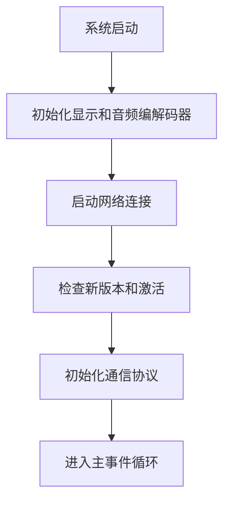
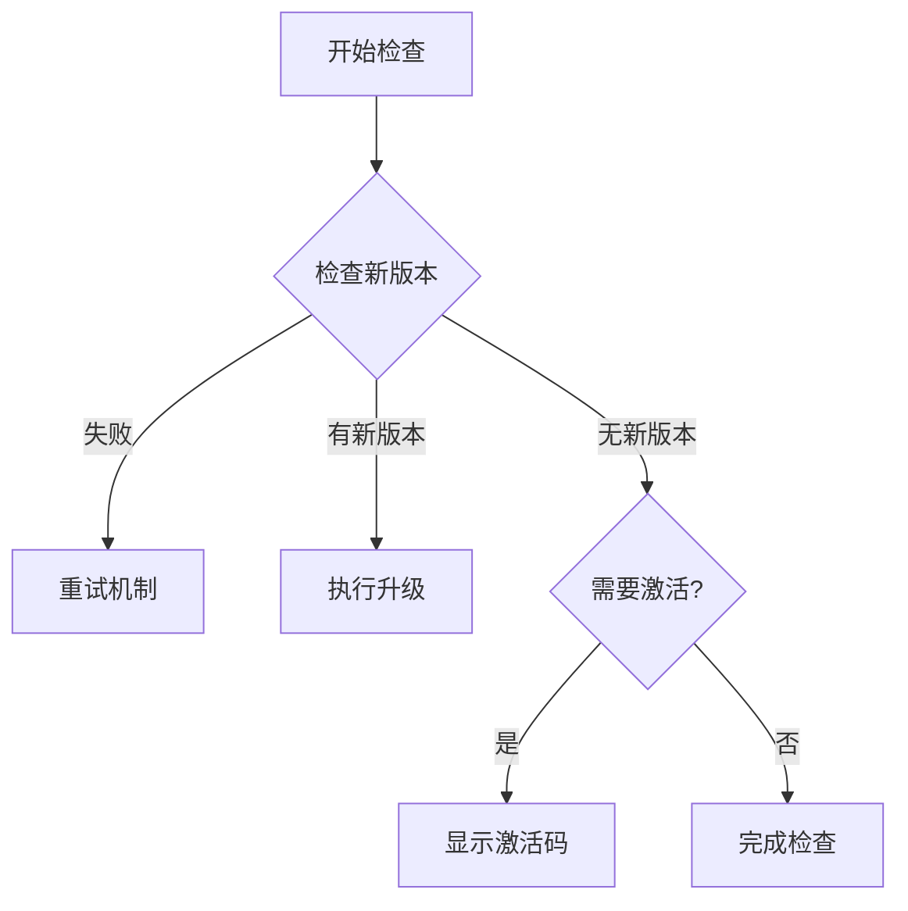
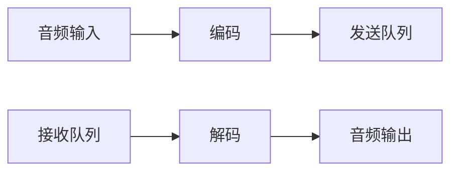

# 基于小智1.7的版本提炼一个 1.8 的开发板开放框架

## 📋 项目概述

这是一个基于 ESP32-S3 的智能语音设备开发框架，从原小智1.7版本提炼而来，专注于提供开放、可扩展的开发板框架。

### 🎯 核心功能

1. **显示时间** - 实时时钟显示功能
2. **播放读书** - 音频播放和语音交互功能

## 🏗️ 系统架构

### Application.cc 核心架构

`main/application.cc` 是整个系统的核心控制模块，采用以下架构设计：

```
Application 类
├── 状态管理 (SetDeviceState)
├── 音频处理 (AudioLoop, OnAudioInput, OnAudioOutput)
├── 网络通信 (MQTT/WebSocket)
├── 显示控制 (Display)
└── 事件循环 (MainEventLoop)
```

### 🔄 主要工作流程

#### 1. 启动流程 (`Start()`)


#### 2. 音频处理流程
- **输入**: 麦克风 → 重采样 → Opus编码 → 发送到服务器
- **输出**: 服务器音频 → Opus解码 → 重采样 → 扬声器

#### 3. 状态管理
```
unknown → starting → configuring → idle
connecting → listening → speaking
```

### 🎵 关键功能模块

#### 版本检查和激活 (`CheckNewVersion`)


#### 音频处理 (`AudioLoop`)


#### 事件循环 (`MainEventLoop`)
- 处理音频发送事件
- 处理调度任务事件
- 管理聊天状态和连接

### 🔧 技术特点

1. **多任务并发**: 使用 FreeRTOS 任务和事件组
2. **音频处理**: Opus 编解码 + 重采样
3. **网络通信**: 支持 MQTT 和 WebSocket
4. **状态管理**: 完整的状态机实现
5. **错误处理**: 重试机制和错误恢复

### ⚡ 性能优化

- **优先级管理**: 主循环优先级3，避免被后台任务中断
- **内存管理**: 智能指针和 RAII
- **音频缓冲**: 队列管理和流控制
- **电源管理**: 空闲时进入省电模式

## 📁 项目结构

```
xiaozhi-esp32/
├── main/                    # 主程序代码
│   ├── application.cc      # 核心应用逻辑
│   ├── board.h            # 硬件抽象层
│   ├── display.h          # 显示控制
│   └── ...
├── scripts/               # 构建脚本
├── docs/                  # 文档
└── README.md             # 项目说明
```

## 🚀 快速开始

### 环境要求
- ESP-IDF 开发环境
- ESP32-S3 开发板
- 音频编解码器支持

### 构建步骤
1. 设置 ESP-IDF 环境
2. 配置项目参数
3. 编译和烧录

## 🔍 核心类说明

### Application 类主要方法

| 方法 | 功能描述 |
|------|----------|
| `Start()` | 应用程序主启动函数，初始化所有组件 |
| `SetDeviceState()` | 设置设备状态，更新显示界面 |
| `AudioLoop()` | 音频处理循环，处理输入输出 |
| `MainEventLoop()` | 主事件循环，处理网络和任务事件 |
| `CheckNewVersion()` | 检查新版本并处理激活流程 |
| `PlaySound()` | 播放音效，支持P3格式音频 |

### 设备状态

| 状态 | 描述 |
|------|------|
| `unknown` | 未知状态 |
| `starting` | 启动中 |
| `configuring` | 配置中 |
| `idle` | 空闲状态 |
| `connecting` | 连接中 |
| `listening` | 监听中 |
| `speaking` | 播放中 |

## 📝 开发说明

这个框架移除了原有的复杂业务逻辑，专注于提供：

1. **开放架构**: 易于扩展和定制
2. **模块化设计**: 清晰的模块分离
3. **标准化接口**: 统一的API设计
4. **完整文档**: 详细的代码注释和说明
